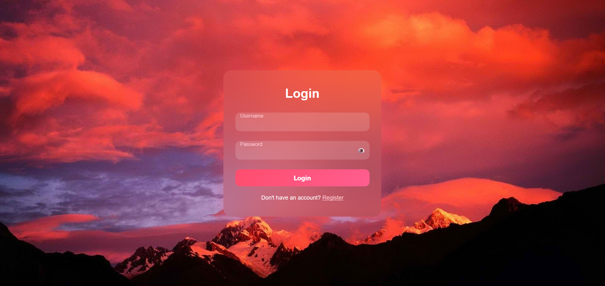

# 🔐 Animated Login Form with Glassmorphism

A stylish and responsive login form built with HTML, CSS, and JavaScript. Features smooth animations, floating labels, a show/hide password toggle, and a beautiful glassmorphism effect over a vibrant background image.


---

## 🌟 Features

- ✨ **Glassmorphism Design**
- 🔍 **Floating Labels on Input Focus**
- 👁️ **Toggle Password Visibility**
- 📱 **Fully Responsive**
- 🌄 **Custom Background Image**
- 💅 **Modern UI with Smooth Transitions**

---

## 🛠️ Technologies Used

- HTML5
- CSS3 (Flexbox, Gradients, Blur Effects)
- JavaScript (Toggle functionality)

---

## 🚀 How to Use

1. **Clone the Repository**
   ```bash
   git clone https://github.com/Srushtee1706/100DAYS_OF_100WEBPROJECTS

Open index.html in Your Browser

You can also use Live Server in VS Code for auto-reload

**Screenshots**



